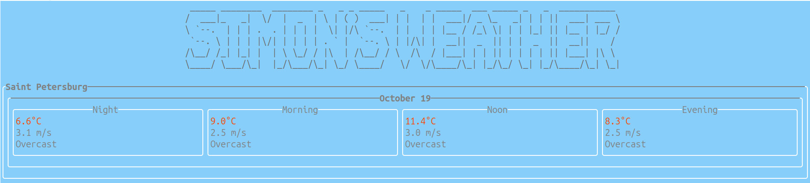

# ConsoleWeather

## Description

Console application that displays weather forecasts for a selected list of cities.

## Preview

## Data source

- [Open-Meteo](https://open-meteo.com/en/docs#latitude=59.94&longitude=30.31&hourly=temperature_2m&forecast_days=16) for forecast
- [Api-Ninjas](https://api-ninjas.com/api/city) to determine coordinates by city name

## Features & interface

 - Display the weather forecast for several days ahead (the default value is set by the config)
 - Update with some frequency (set by config)
 - Switch between cities using the keys "n", "p"
 - End the program using Esc
 - Increase/decrease the number of forecast days by pressing the “+”, “-” keys

The list of cities, update frequency, number of forecast days must be defined in json config "configs/my_config".
As well as config with ninja api key: "api_ninjas.json".

## Dependencies

- CPR for requests
- ftxui for user interface
- nlohmann for json interaction